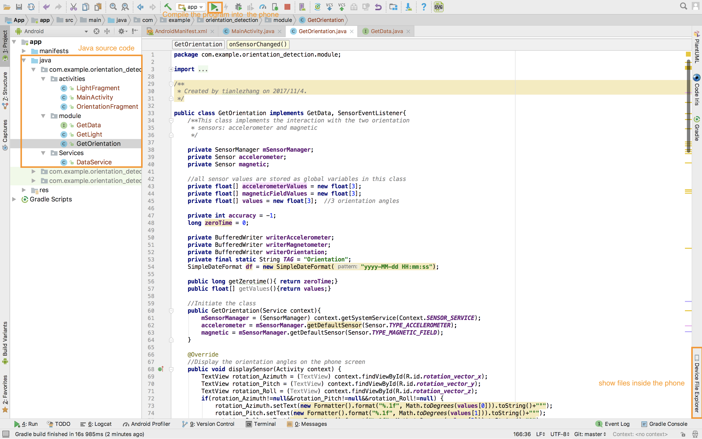
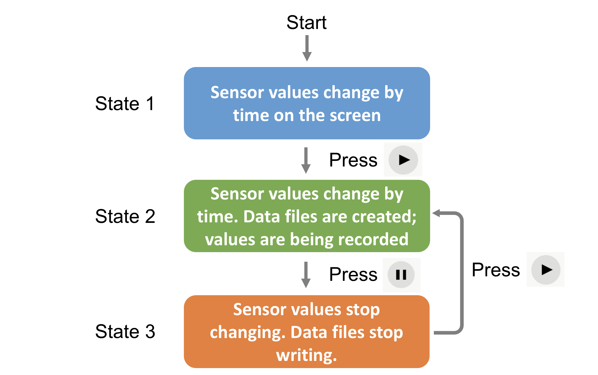
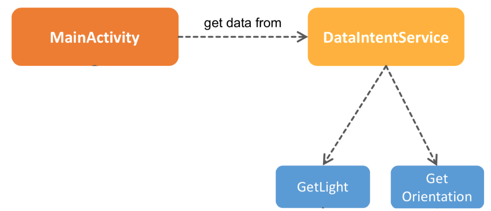

# OrientationDetection

An Android app able to get spatial orientation and light data of the phone. 

## Installing

1. Download [Android Studio](https://developer.android.com/studio/). 

2. Press the green button "Clone or download" on the [github page](https://github.com/UOETianleZhang/OrientationDetection), and choose "Download ZIP". After unzipping the file on the computer, you can see the file includes two folders: App and MATLAB.

   > **App**: The source code of the Android application.

   > **MATLAB**: Some MATLAB files supporting the data processing.

3. Open Android Studio, click "Open an existing Android Studio Project" and find the "App" folder. 

4. The Android Studio interface should look like this

   

5. Connect the computer to an Android phone/tablet, and ensure you have opened the developer mode on the phone. (To enable the Android Studio detect your phone/tablet: open "Setting" -> "Developer Mode" -> switch on "USB debugger". Please note that the procedure may differ on different Android brands, and sometimes the "Developer Mode" can be hidden. Goolge it when fail to find it.) If it is set successfully, when pressing the green "Run" button on the Android Studio, the phone/tablet name should be shown on the computer.

6. After compiling, the App will be installed on the phone/tablet and automatically start.

   ​

## Using the App

The app records the sensor data to 4 files: "*DataMagnetometer.txt*" (magnetic field values by time), *"DataAccelerometer.txt"*(acceleration values by time), *“DataOrientation.txt”* (orientation angles by time; please note that it is just a rough estimation, and the exact values should be calculated from two files above) and *"DataLight.txt"* (illuminance value by time). 

### Record the data

When opening the app, it goes into the state 1 as shown above. If you'd like to record the data during a fixed period time, press the triangle button on the screen and press the button again to stop recording when finishing. If you press the triangle button again, the data files would be deleted and rewitten, so please be careful.

### Copy the data files to your desktop

When finishing the recording, connect the phone/tablet to your computer. Then  choose "View"->"Tool Windows"-> "Device File Explorer" in the Andoid Studio. (Also it can be fould at the bottom right corner in the Android Stuidio.) All the data files are put at "/sdcard/", e.g., "/sdcard/DataAccelerometer.txt". Please note that the file explorer can only display the file at the time when the phone connects to the computer, i.e., the file won't change on the file explorer even if it is recording the data.

## Source Code

###Java code

The main part of Java source code includes 4 files: MainActivity, DataService, GetLight and GetOrientation.

1. **MainActivity**: the entrance of the whole program, controls the display of UI. It contains four main UI components: Toolbar, NavigationView class, LightFragment class and OrientationFragment class.
2. **DataService:** The acquisition of the orientation & light data is realised by it. The DataService class calls functions of the GetLight class and the GetOrientation class.
3. **GetLight**: This class implements the interaction with the light sensor extends. It has several methods (functions): 
   - By calling the **𝑖𝑛𝑖𝑡𝑆𝑒𝑛𝑠𝑜𝑟()**, the physical light sensor of the phone is registered and starts working;
   - By the **𝑑𝑖𝑠𝑝𝑙𝑎𝑦𝑆𝑒𝑛𝑠𝑜𝑟()**, the illuminance number on the screen can be refreshed once; 
   - By the **𝑑𝑒𝑠𝑡𝑟𝑜𝑦𝑆𝑒𝑛𝑠𝑜𝑟()**, the light sensor will stop working. 
   - **𝑜𝑛𝑆𝑒𝑛𝑠𝑜𝑟𝐶ℎ𝑎𝑛𝑔𝑒𝑑()**: This method is the most important method in the class. It is called by the system automatically when the sensor value changes (illuminance here)
4. **GetOrientation:** similar with GetLight. Attention that to get the orientation, two sensors (accelerometer and magnetic filed sensor) are used, so the code is more complicated, but the structure is the same.

### Adjust the parameters

|          Parameter          | Introduction                             |                 Posotion                 |
| :-------------------------: | :--------------------------------------- | :--------------------------------------: |
|      Sampling Interval      | The time difference between two samplings. This is only a hint to the system. Events may be received faster or slower than the specified rate.Usually events are received faster. | GetOrientation  -> initSensor()；   GetLight ->initSensor() |
| Screen data    refresh rate | The refresh frequency of sensor data on the screen. It won't influence the sampling frequency. Default: 0.08s |        MainActivity -> onResume()        |
|       Data file paths       | Storage paths of data files.             | GetOrientation  -> initSensor()；   GetLight ->initSensor() |